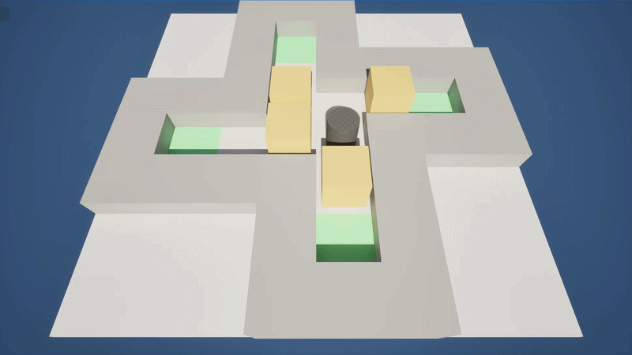
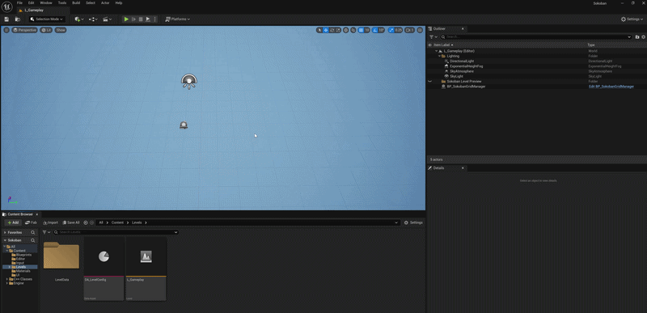
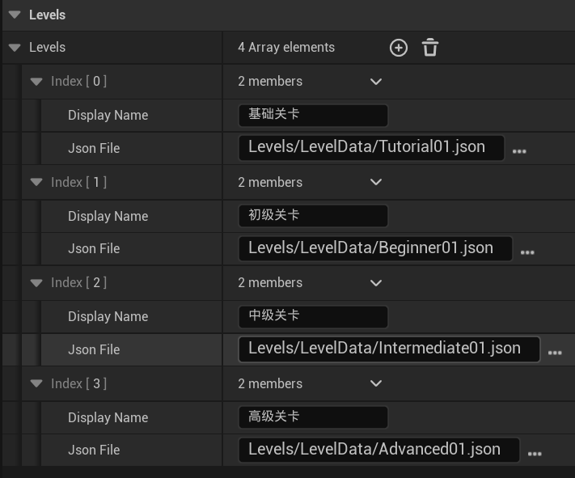

# Sokoban — 3D 推箱子 Demo

基于 Unreal Engine 5.5.4 开发的推箱子解谜游戏 Demo，包含完整的游戏流程和引擎内关卡编辑器。

---

## 试玩说明

### 游戏规则

1. 玩家在封闭房间内推动箱子，将**所有箱子**推到**目标点**上即可过关
2. 玩家一次只能推动一个箱子，不能拉箱子
3. 特殊机制：关卡中存在冰面，玩家和箱子踏上冰面后会沿当前方向持续滑行，直到碰到墙壁或非冰面地块才会停下

<div align="center">
  
</div>

### 操作方式

| 按键 | 功能 |
|---|------|
| W / A / S / D | 移动玩家（上/左/下/右） |
| Z | 撤销上一步移动 |
| R | 重置当前关卡 |
| Enter / 鼠标点击 | 通关后进入下一关 |

### 游戏流程

主菜单提供四个难度分类：教学、初级、中级、高级。通关后可选择进入下一关或返回主菜单。

---

## 关卡编辑器使用说明

### 进入编辑器

1. 打开 UE 编辑器，在 Viewport 上方的模式切换栏中选择 **推箱子编辑**
2. 工具面板会显示 2D 网格编辑界面，Viewport 中会出现实时 3D 预览

<div align="center">
  
</div>

### 编辑操作

**画笔模式切换：**
- **地格**：在下拉菜单中选择地块类型（墙体/冰面/目标点），点击或拖动网格绘制
- **实体**：选择实体类型（玩家/箱子），点击放置。玩家只能有一个，重复放置会自动移除旧的
- **擦除**：清除格子上的实体或将地块还原为空地格

**网格大小调整：**
- 在工具面板中修改宽和高，点击应用后更新，已有内容在范围内会保留

### 保存与加载

- **保存**：点击保存按钮，弹出文件对话框，保存为 JSON 格式
- **加载**：点击加载按钮，从文件对话框选择 JSON 文件加载
- **保存验证**：保存时会强制检查——必须有且仅有 1 个玩家、至少 1 个箱子、至少 1 个目标点、箱子数量必须等于目标点数量。不满足条件时弹出错误对话框，阻止保存

### 试玩

- 点击 **试玩** 按钮，编辑器会将当前关卡保存为临时文件并启动 PIE 测试
- 试玩前同样会进行关卡验证
- PIE 结束后自动恢复编辑器预览

### Json格式

```
{
	"name": "Tutorial01",
	"width": 8,
	"height": 8,
	"_地格索引": "0=空地 1=墙体 2=冰面 3=目标点",
	"_实体索引": "0=无 1=玩家 2=箱子",
	"tiles": [
		[ 0, 0, 0, 1, 1, 1, 0, 0 ],
		[ 0, 0, 0, 1, 3, 1, 0, 0 ],
		[ 1, 1, 1, 1, 0, 1, 0, 0 ],
		[ 1, 3, 0, 0, 0, 1, 1, 1 ],
		[ 1, 1, 1, 0, 0, 0, 3, 1 ],
		[ 0, 0, 1, 0, 1, 1, 1, 1 ],
		[ 0, 0, 1, 3, 1, 0, 0, 0 ],
		[ 0, 0, 1, 1, 1, 0, 0, 0 ]
	],
	"entities": [
		[ 0, 0, 0, 0, 0, 0, 0, 0 ],
		[ 0, 0, 0, 0, 0, 0, 0, 0 ],
		[ 0, 0, 0, 0, 2, 0, 0, 0 ],
		[ 0, 0, 0, 2, 1, 0, 0, 0 ],
		[ 0, 0, 0, 2, 0, 2, 0, 0 ],
		[ 0, 0, 0, 0, 0, 0, 0, 0 ],
		[ 0, 0, 0, 0, 0, 0, 0, 0 ],
		[ 0, 0, 0, 0, 0, 0, 0, 0 ]
	]
}

```

---

## Runtime 关卡场景配置

游戏关卡中只需放置以下内容：

1. **`BP_SokobanGridManager`**：放置到关卡中，在 Details 面板中将 `LevelConfig` 属性指向 `DA_LevelConfig` DataAsset

> 不需要手动放置地块或实体 Actor，Runtime 时 GridManager 会根据 JSON 文件自动生成所有游戏对象。

### 关卡配置 DataAsset

`DA_LevelConfig`（类型 `USokobanLevelConfig`）中配置一个平铺的关卡数组，按顺序排列所有关卡：

<div align="center">
  
</div>

---

## 代码架构

### 模块划分

```
Sokoban.uproject
├── Source/Sokoban/          ← Runtime 模块（游戏逻辑）
└── Source/SokobanEditor/    ← Editor 模块（关卡编辑器，仅编辑器加载）
```

### 核心类职责

**Runtime（Source/Sokoban/）：**

| 类 | 职责                                                 |
|----|----------------------------------------------------|
| `ASokobanGridManager` | 核心游戏逻辑：网格状态管理、移动/推箱、冰面滑行、胜利检测、撤销/重置、关卡加载           |
| `ASokobanPlayerController` | 输入处理（Enhanced Input）、UI 生命周期管理（主菜单/通关界面的显隐与输入模式切换） |
| `ASokobanMovableActor` | 可移动 Actor 基类，提供平滑 Lerp 位移动画                        |
| `ASokobanPawn` / `ASokobanBoxActor` | 玩家 / 箱子，继承自 MovableActor                           |
| `ASokobanTileActor` | 地块可视化，根据 TileType 切换材质                             |
| `USokobanLevelConfig` | DataAsset，配置所有Runtime关卡的名称和 JSON 路径                |
| `USokobanMainMenuWidget` / `USokobanWinScreenWidget` | UMG Widget C++ 基类，定义按钮绑定和 delegate                 |

**Editor（Source/SokobanEditor/）：**

| 类 | 职责 |
|----|------|
| `UEditorGridSubsystem` | 编辑器数据层：网格创建/编辑、JSON 读写、关卡验证、3D 预览生成、PlayTest |
| `USokobanEditorMode` | EdMode 注册，管理工具集生命周期 |
| `FSokobanEdModeToolkit` | 工具面板 UI（Slate），包含画笔选择、网格尺寸、保存/加载按钮 |
| `SSokobanGrid` | 自定义 Slate 控件（SLeafWidget），实现交互式 2D 网格可视化编辑 |
